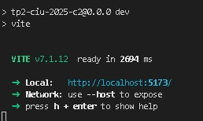

# FrontEnd Red Anti-Social

## Universidad Nacional de Hurlingham
## Trabajo Practico Nº 2 - Construccion de Interfaces de Usuario
### Segundo Cuatrimestre - Año 2025

### Docentes
- Lucas Adriel Figarola
- Ailen Pisoni

### Grupo 13
#### Integrantes:

- Ezequiel Andrés Muñoz
- Facundo Roberto Arias
- Asam Fernando
- Meza Tomás Luciano
- Javier Asato Finen

## Descripcion del Proyecto

FrontEnd de Red Anti-Social es una pagina web hecha en React y Typescript, que permite a un usuario del sitio
registrarse con validacion de datos, crear posts, comentar posts y visualizar posts propios y de otros usuarios.
La creacion de posts permite agregar una descripcion, imagenes y tags.
El sitio tambien ofrece la posibilidad comentar posts de otros usuarios y recibir comentarios en los propios.
Existen 2 secciones donde pueden visualizarse las ultimas publicaciones de otros usuarios con un boton de enlace
en cada una para ver su detalle asi como las propias.

## Caracteristicas

### Paginas

**Home**:

La página de Inicio busca ser una presentación atractiva de Luna & Granos Café, diseñada para captar la atención del visitante desde el primer momento. Tiene como objetivo transmitir la identidad de la cafetería  invitando al usuario a descubrir la carta y conocer más sobre la historia y los valores del local.

Funcionalidades y secciones:

. Hero principal: muestra el nombre del café, un eslogan y un botón que dirige directamente a la carta.
. Sección “Quiénes Somos”: breve descripción de la filosofía del lugar acompañada por una galería de imágenes que muestran el interior y ambiente del café.
. Nuestra Historia: relato sobre el origen familiar y la inspiración italiana detrás del emprendimiento, destacando la calidad y tradición en cada taza.
. Valores: tres pilares que resumen la propuesta del café (café de especialidad, pastelería artesanal y conexión con lo natural).
. Concenos: invitación a visitar el local con un mapa interactivo de Google Maps que facilita la ubicación.

**Perfil**:

En la sección Perfil los usuarios pueden:

- Ver Todos los post publicados por el usuario logueado
- Acceder al detalle del post

**Publicar**:

En la sección Publicar los usuarios pueden:

- Cargar una descripcion del post
- Agregar imagenes
- Agregar tags
- Agregar imagenes

Si se cancela la edicion del post con el boton cancelar edicion se redirige a la seccion Perfil

**PostDetalle**:

En la sección PostDetalle los usuarios pueden:

- Ver el detalle de todos los comentarios del post
- Realizar comentarios

**Iniciar Sesion**:

En la sección Iniciar Sesion los usuarios pueden:

- Iniciar sesion en la aplicacion ingresando un nickName y contraseña predefinida
- Crear una cuenta con el enlace debajo del boton para iniciar sesion

**Registro**:

En la sección Registro los usuarios pueden:

- Crear una cuenta en la aplicacion ingresando datos q se validan en tiempo real y cuando se intenta crear la cuenta
- Una vez registrado se redirige a la seccion Perfil


## Tecnologias

**Cliente:** React, Bootsrap, Vite, Typescript

**Servidor:** Node

## 📦 Dependencias

#### ⚙️ Dependencias de produccion

```json
  "dependencies": {
    "bootstrap": "^5.3.8",
    "bootstrap-icons": "^1.13.1",
    "react": "^19.1.1",
    "react-bootstrap": "^2.10.10",
    "react-dom": "^19.2.0",
    "react-router-dom": "^7.9.5",
    "yup": "^1.7.1"
  }
```
#### 🧰 Dependencias de desarrollo

```json
  "devDependencies": {
    "@eslint/js": "^9.36.0",
    "@types/node": "^24.6.0",
    "@types/react": "^19.1.16",
    "@types/react-dom": "^19.1.9",
    "@vitejs/plugin-react": "^5.0.4",
    "eslint": "^9.36.0",
    "eslint-plugin-react-hooks": "^5.2.0",
    "eslint-plugin-react-refresh": "^0.4.22",
    "globals": "^16.4.0",
    "typescript": "~5.9.3",
    "typescript-eslint": "^8.45.0",
    "vite": "^7.1.7"
  }
```
    
## Correr el Proyecto

#### Clonar el proyecto

```bash
  git clone https://github.com/AsamFernando/tp2-ciu-2025-2c.git
```

#### Ir a la carpeta del proyecto

```bash
  cd tp2-ciu-2025-c2
```

#### Abrir con Vs Code

```bash
  code .
```

#### Instalar dependencias

```bash
  npm install
```

#### Clonar la API para el Backend

```bash
  git clone https://github.com/lucasfigarola/backend-api.git
```

#### Ir a la carpeta de la API

```bash
  cd backend-api
```

#### Instalar dependencias

```bash
  npm install
```

#### Correr el FrontEnd y BackEnd ubicado en las carpetas respectivas en dos terminales distintas

```bash
  npm run dev
```
#### Seguir el enlace que aparece en la terminal para abrir el sitio en el navegador



## Estructura del Proyecto

```
📁 tp2-ciu-2025-c2
    ├───📁 public
    └───📁 src
        ├───📁 api
        ├───📁 assets
        ├───📁 components
        │   ├───📁 CarouselPostImages
        │   ├───📁 FormInput
        │   ├───📁 Layout
        │   ├───📁 MostrarImagenes
        │   ├───📁 MostrarTags
        │   ├───📁 NavBar
        │   ├───📁 Post
        │   ├───📁 PostCompleto
        │   ├───📁 PostPerfil
        │   └───📁 UserProvider
        ├───📁 Contexts
        │   └───📁 default
        ├───📁 estilos
        ├───📁 pages
        ├───📁 schemas
        └───📁 Types

```